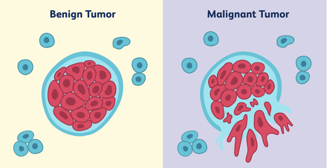

# Breast cancer detection using ML

The database used in this project is the **Wisconsin Breast Cancer Database** which can be found on [Kaggle](https://www.kaggle.com/datasets/uciml/breast-cancer-wisconsin-data). There are 569 real samples in the database, and for each of them there are 30 attributes that describe it in more detail. Each sample has an assigned diagnosis class that indicates which tumor it is. The tumor can be malignant or benign. The goal of the project is to implement ML algorithms and try to use them to assess whether a new sample has a malignant or benign tumor.



The ML techniques used in this project are:
- [Decision tree](https://scikit-learn.org/stable/modules/tree.html)
- [Random forrest](https://scikit-learn.org/stable/modules/generated/sklearn.ensemble.RandomForestClassifier.html)
- [AdaBoost](https://scikit-learn.org/stable/modules/ensemble.html#adaboost)
- [XGBoost](https://xgboost.readthedocs.io/en/stable/python/python_intro.html)
- [Logistic regression](https://scikit-learn.org/stable/modules/linear_model.html#logistic-regression)
- [Naive Bayes](https://scikit-learn.org/stable/modules/naive_bayes.html#naive-bayes)

## Report

You can see the entire report in the [projekatML.pdf](./projekatML.pdf).
The following image shows the content of the report:


## Results

The best performance of each of the mentioned ML techniques is shown in the following images:


## Instructions
Firstly, install all basic dependencies:
```bash
pip install matplotlib
```
```bash
pip install numpy
```
```bash
pip install pandas
```
```bash
pip install seaborn
```
```bash
pip install xgboost
```
```bash
pip install scikit-learn
```

Then, you can easily run the code by copying the following command into the terminal:
```bash
python3 classification.py
```
